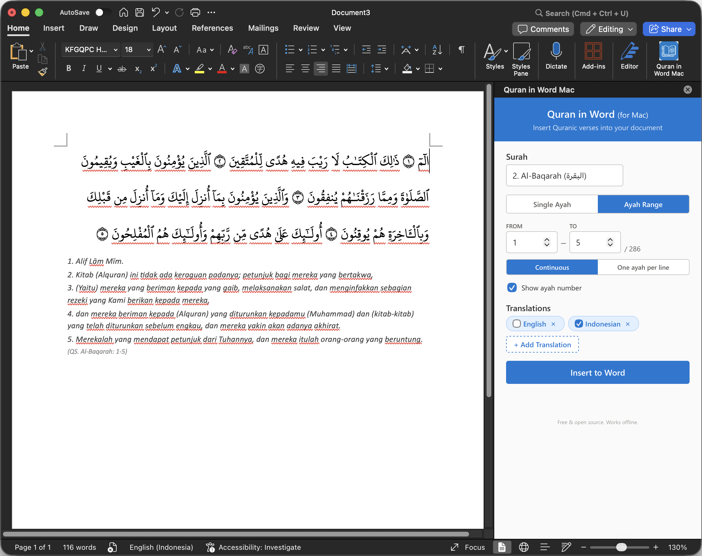

# Quran in Word (for Mac)

A free, open-source Microsoft Word add-in for macOS that lets you insert Quranic verses with Arabic text and translations directly into your Word documents.



## Features

- **Full Quran** - All 114 surahs, 6,236 ayahs
- **Arabic Uthmani text** - Sourced from quran.com (text_uthmani) with KFGQPC HAFS Uthmanic Script font
- **15 translation languages** - English, Indonesian, French, Spanish, German, Turkish, Urdu, Malay, Japanese, Chinese, Korean, Russian, Hindi, Bengali, Thai
- **Dynamic language selector** - Add/remove translations (1-3 active), preferences saved locally
- **Two insert modes** - Single ayah or ayah range
- **Range layout options** - Continuous (mushaf-style) or one ayah per line
- **Show/hide ayah numbers** - Toggle ayah number visibility in range mode
- **Searchable surah selector** - Filter by surah name, number, or Arabic name
- **Verse numbering** - Optional Arabic-Indic ayah markers in mushaf style
- **Offline support** - Service worker caches all assets; API translations cached after first load
- **No server required** - Hosted on GitHub Pages, no localhost needed

## Compatibility

| Requirement | Minimum |
|---|---|
| **macOS** | 10.15 (Catalina) or later |
| **Microsoft Word** | Version 16.9 or later |

### Compatible Word versions

| Edition | Compatible |
|---|---|
| Microsoft 365 for Mac | Yes |
| Office 2024 for Mac | Yes |
| Office 2021 for Mac | Yes |
| Office 2019 for Mac (v16.9+) | Yes |
| Office 2016 for Mac | No |

## Installation

### One-line install

Open Terminal and run:

```bash
curl -fsSL https://kramadan83.github.io/quran_mac_word/install.sh | bash
```

Then:
1. Quit Word completely (Cmd+Q)
2. Open Word
3. Go to **Insert** > **My Add-ins** > **Shared Folder** tab
4. Select **"Quran in Word Mac"** and click **Add**
5. The button appears in the **Home** tab ribbon

### Manual install

**Step 1** - Install the Arabic font:
```bash
curl -L -o ~/Library/Fonts/UthmanicHafs1Ver18.ttf \
  https://kramadan83.github.io/quran_mac_word/fonts/UthmanicHafs1Ver18.ttf
```

**Step 2** - Install the add-in manifest:
```bash
mkdir -p ~/Library/Containers/com.microsoft.Word/Data/Documents/wef
curl -o ~/Library/Containers/com.microsoft.Word/Data/Documents/wef/manifest.xml \
  https://kramadan83.github.io/quran_mac_word/manifest.xml
```

**Step 3** - Restart Word and load the add-in from Insert > My Add-ins > Shared Folder.

### Uninstall

```bash
curl -fsSL https://kramadan83.github.io/quran_mac_word/install.sh | bash -s -- --uninstall
```

## Architecture

```
quran_addins_word/
+-- src/
|   +-- taskpane/
|   |   +-- taskpane.html           # Add-in UI (taskpane panel)
|   |   +-- taskpane.js             # Core logic: data loading, Word API, search
|   |   +-- taskpane.css            # Styles (Fluent UI based)
|   |   +-- translationRegistry.js  # Language config for 15 translations
|   |   +-- translationLoader.js    # Unified fetch: bundled + API
|   +-- commands/
|   |   +-- commands.html           # Ribbon command handler
|   |   +-- commands.js
|   +-- data/
|   |   +-- surahList.json     # Surah metadata (114 entries)
|   |   +-- arabic/*.json      # Arabic text per surah (from quran.com API v4)
|   |   +-- english/*.json     # English translation per surah (from quran.com, Sahih International)
|   |   +-- indonesian/*.json  # Indonesian translation per surah (from quran.com, Kemenag RI)
|   +-- fonts/
|   |   +-- UthmanicHafs1Ver18.ttf  # KFGQPC HAFS Uthmanic Script font
|   +-- service-worker.js      # Offline caching (app + API translation cache)
+-- scripts/
|   +-- fetch-translations.mjs # Fetch/update bundled translations from quran.com API
+-- assets/                    # Add-in icons (16, 32, 64, 80, 128px)
+-- manifest.xml               # Office add-in manifest (dev, localhost)
+-- install.sh                 # One-line installer/uninstaller
+-- webpack.config.js          # Build config (dev + production)
+-- package.json
```

### How it works

```
+-------------------+     +--------------------+     +------------------+
|   Word for Mac    |     |  GitHub Pages      |     |  quran.com API   |
|                   |     |  (Static hosting)  |     |  (Data + Trans)  |
|  +-------------+  |     |                    |     |                  |
|  | Ribbon Btn  |--+---->| taskpane.html/js   |     |  text_uthmani    |
|  +-------------+  |     | (webpack bundles)  |     |  (Arabic text)   |
|                   |     |                    |     |                  |
|  +-------------+  |     | arabic/*.json      |     |  translations/   |
|  | Taskpane    |<-+-----| english/*.json     |<----+  (13 languages   |
|  | (WebView)   |  |     | indonesian/*.json  |     |   fetched live)  |
|  +-------------+  |     |                    |     +------------------+
|        |          |     | service-worker.js  |
|        v          |     | (app + API cache)  |
|  +-------------+  |     |                    |
|  | Word Doc    |  |     | fonts/             |
|  | (Insert API)|  |     | UthmanicHafs.ttf   |
|  +-------------+  |     +--------------------+
+-------------------+
```

### Data flow

1. User selects a surah, ayah range, and active translations (1-3) in the taskpane
2. Arabic data is lazy-loaded via webpack dynamic imports (`import()`)
3. Bundled translations (EN/ID) loaded via webpack; API translations fetched from quran.com API v4
4. API responses are cached by the service worker for offline use after first load
5. Arabic text is cleaned (waqf marks stripped for Word compatibility)
6. Text is inserted into Word via the Office JS API (`Word.run()`)
7. In continuous layout, all ayahs are joined in one paragraph; in per-line layout, each ayah gets its own paragraph
8. Arabic text and verse markers are inserted as separate runs with different font sizes
9. Translations are inserted as separate paragraphs with per-language font and direction handling

### Key technical decisions

| Decision | Reason |
|---|---|
| **Dynamic imports per surah** | Lazy-load only the surahs needed, not all 4.8MB at once |
| **Bundled EN/ID + API for rest** | English and Indonesian (from quran.com API) bundled for offline use; 13 other languages fetched on demand |
| **Cache-first for API translations** | Translation data is immutable; cache-first avoids unnecessary network traffic |
| **Null font for CJK/Indic** | Letting Word use system font fallback renders better than specifying a font that may not exist |
| **Waqf marks stripped** | Word on Mac renders combining marks (U+06D6-U+06DC) as dotted circles |
| **No U+06DD for verse numbers** | Word on Mac renders it as a separate blank circle alongside the digit |
| **Arabic-Indic digits for markers** | KFGQPC font renders these inside ornamental circles natively |
| **Stale-while-revalidate SW** | Serves cached same-origin assets instantly, updates in background |
| **Font URL relative in CSS** | Required for GitHub Pages subdirectory deployment (`/quran_mac_word/`) |
| **Footnote refs stripped** | Indonesian source data contains `7)`, `8)` artifacts from print edition |

### Supported translations

| Language | Source | Translator |
|---|---|---|
| English | Bundled | Sahih International |
| Indonesian | Bundled | Kemenag RI |
| French | API | Muhammad Hamidullah |
| Spanish | API | Sheikh Isa Garcia |
| German | API | Frank Bubenheim & Nadeem |
| Turkish | API | Diyanet Isleri |
| Urdu | API | Abul A'la Maududi |
| Malay | API | Abdullah Basmeih |
| Japanese | API | Ryoichi Mita |
| Chinese | API | Ma Jian |
| Korean | API | Korean Translation |
| Russian | API | Elmir Kuliev |
| Hindi | API | Maulana Azizul Haque |
| Bengali | API | Sheikh Mujibur Rahman |
| Thai | API | King Fahad Complex |

### Data sources

| Data | Source | Notes |
|---|---|---|
| Arabic (Uthmani) | [quran.com API v4](https://api.quran.com/api/v4/quran/verses/uthmani) | Official Uthmani text |
| English | [quran.com API v4](https://api.quran.com/api/v4/quran/translations/20) | Sahih International (edition 20) |
| Indonesian | [quran.com API v4](https://api.quran.com/api/v4/quran/translations/33) | Kementerian Agama RI (edition 33) |
| Other translations | [quran.com API v4](https://api.quran.com/api/v4/resources/translations) | 13 languages fetched at runtime |
| Font | [quran.com GitHub](https://github.com/nickvdyck/quran.com-frontend) | UthmanicHafs v18 (KFGQPC HAFS) |

## Development

### Prerequisites

- Node.js 16+
- npm

### Setup

```bash
npm install
```

### Run locally (dev mode)

```bash
npm start
```

This starts a webpack dev server at `https://localhost:3000` with the dev manifest.

### Production build

```bash
npx webpack --mode production
```

Output goes to `dist/`. All `localhost` URLs in the manifest are replaced with the GitHub Pages URL.

### Deploy to GitHub Pages

```bash
npx gh-pages -d dist
```

## License

Free and open source.
